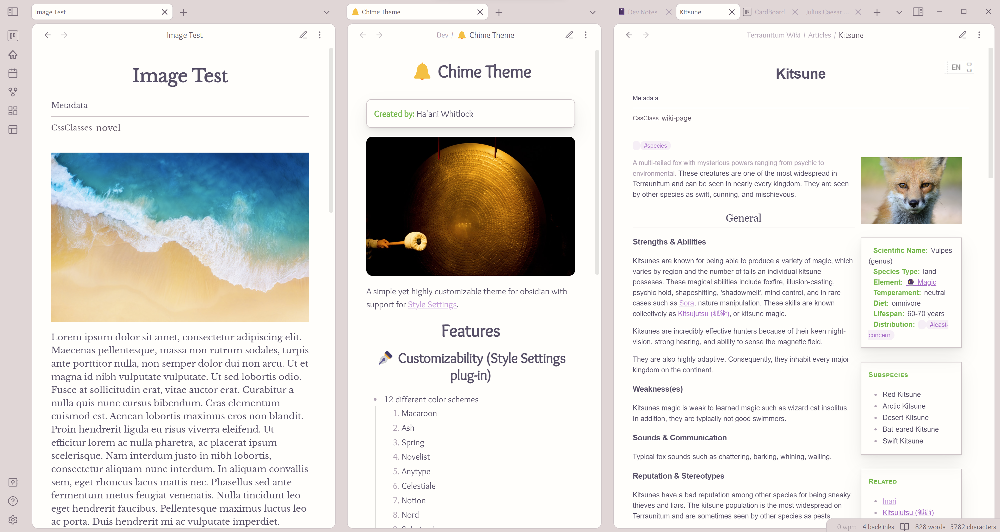
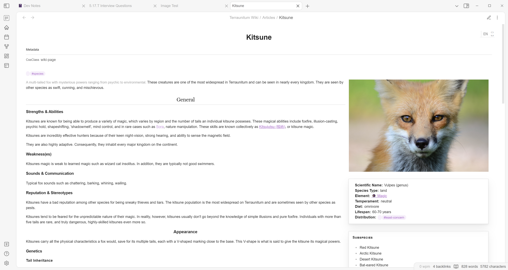
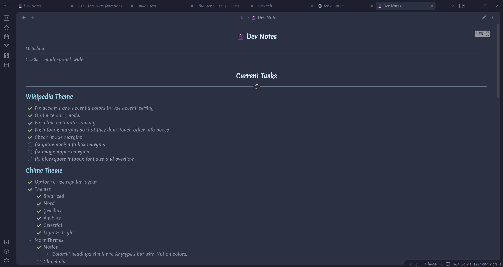
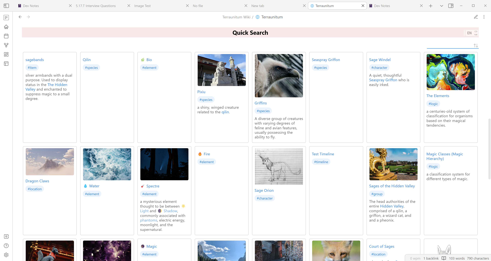
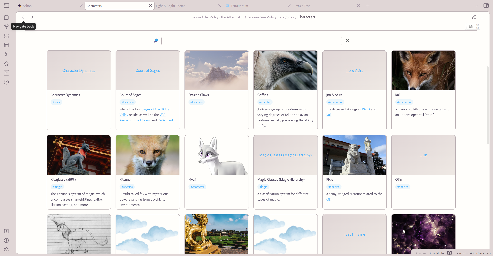

# 🔔 Chime

A lightweight theme for Obsidian designed to be simple yet highly customizable.
# Features

## ✒️ Customizability (with Style Settings plug-in)
- 12 different color schemes
- Choose between the Card and Classic layout styles.
- Options for blockquotes, headings, checkboxes, and more.  
## ✅ Simplicity
Chime was designed with a special intention to not overwhelm you with options. Customizability is given for only the most important components.
## 🚩 CSS Classes
Chime includes four css classes that may come in handy to some people.
### Wiki-page Class
Format your note like a wiki page. This class floats images, blockquotes, and callouts to the right and formats headings and text. To use, type `cssClasses: wiki-page` in a note's frontmatter.

### Novel Class
Format your note like a page in a book. This class changes the font, indentation, and paragraph spacing. Pressing enter once creates a normal paragraph without an indent (great if you don't like indented dialogue), while pressing enter twice, like you would usually create a paragraph in Obsidian, creates an indented paragraph. Both paragraphs are evenly spaced in preview mode. 
To use, type `Cssclasses: novel` in the frontmatter of a note.

### Wide Class
Sometimes I wish Obsidian was more like Notion and allowed me to make certain pages automatically wider without messing with settings--Which is why I made this CSS class. This will make a note wide even when Readable Line Length is turned on. To use, type `Cssclasses: wide` in the frontmatter.

### Cards Class (by kepano)
The spectacular cards CSS class was originally created for the Minimal Theme by kepano.

This class will make items in dataview tables show up in a card-like grid. To use, type `cssClasses: cards` in the frontmatter. This class requires the **dataview** plug-in.

## 🔌 Compatible Plug-Ins
### Dataview
**Chime** includes styling for inline metadata and dataview tables. The `cards` class also utilizes this plug-in.

### Pages Gallery
Chime makes minor changes to the **Pages Gallery** plug-in and gives it an appearance similar to that of the cards css class. Text will now break and continue on a new line rather than overflowing, and tile heights will change according to the text. Images will be automatically set to *cover* and will override *contain* (this may change later, I just couldn't get the images to force certain ratios in contain mode). The font size within the tiles has been adjusted and a style setting has been added to get rid of the searchbar.

### Cardboard
An extremely minor change has been made to the text color.

# ⭐ Credits
A special thanks to...
- kepano for their amazing Minimal theme
  - Inspiration
  - cards CSS class
- Anubis for the phenomenal AnuPpuccin theme
  - rainbow folders option
- The developers of *Obsidian*.
  - I wouldn't have learned CSS without this app.
# 📋 To-Do
- [x] update README
- [x] Add header bottom border option
- [ ] Add custom link and tag options
 
