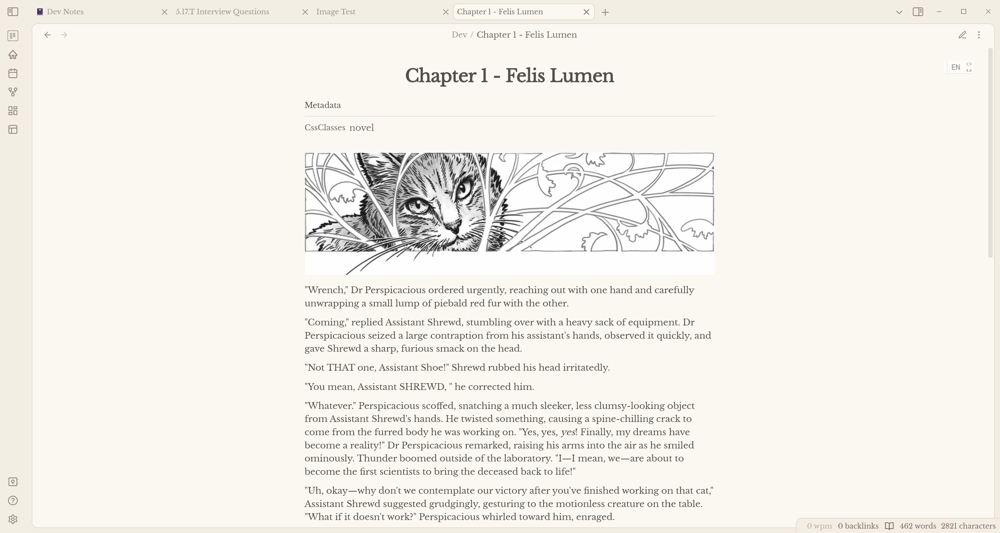

# 🔔 Chime

Chime was designed with a special intention to not overwhelm you with options. Built on the principle of highly customizable simplicity, **Chime** provides vast personalization options without going past only what's most important.

# Features

With the Style Settings plug-in, **Chime** boasts the following features:

- 12 different **color schemes**
- Two different **layout styles.**
- Hide certain buttons and enable full-screen **Focus Mode**
- Special style settings for the **page-gallery plug-in**
- Options for styling **blockquotes, headings, checkboxes, links,** and *more*.
- Four special css classes

# CSS Classes

Chime includes four css classes that may come in handy to some people.

| Image| Class | Description |
|--------------------|-----------|---------------------|
|| `wiki-page` | Format your note like a wiki page. This class floats **images** and **info blockquotes** to the right and formats headings and text.|
|  | `novel` | Format your note like a page in a book. This class changes the **font, indentation, and paragraph spacing.** Pressing enter **once** creates a **normal paragraph** without an indent (great if you don't like indented dialogue), while pressing enter **twice**, like you would usually create a paragraph in Obsidian, creates an **indented paragraph**. Both paragraphs are evenly spaced in preview mode. |
|| `wide` | Makes a note wide even when Readable Line Length is turned on. |
|| `cards` (by [kepano](https://github.com/kepano)) |      Makes dataview tables show up as a grid of cards. Originally created by kepano for the Minimal theme. |

# 🔌 Compatible Plug-Ins

## Dataview

**Chime** includes styling for inline metadata and dataview tables. The `cards` class also utilizes this plug-in.

## Pages Gallery

Chime makes minor changes to the **Pages Gallery** plug-in and gives it an appearance similar to that of the cards css class. Text will now break and continue on a new line rather than overflowing when *responsive height* is enabled, and the tiles will be resized according to amount of text with the *loose tiles* setting. Images will be automatically set to *cover* and will override *contain* (this may change later, I just couldn't get the images to force certain ratios in contain mode). The font size within the tiles has been adjusted and a style setting has been added to get rid of the searchbar.

# 💖 Credits

A special thanks to...

- kepano for their amazing Minimal theme
  - Inspiration
  - cards CSS class
- Anubis for the phenomenal AnuPpuccin theme
  - rainbow folders option
- The developers of *Obsidian*.
  - I wouldn't have learned CSS without this app.

# 💬 Want to Contribute to Chime?

Feel free to make a [pull request](https://github.com/Bluemoondragon07/chime-theme/pulls) to add a new color scheme, layout variant...you name it. I am open to merging any style settings options that you come up with.

*You* control the future of **Chime.**
